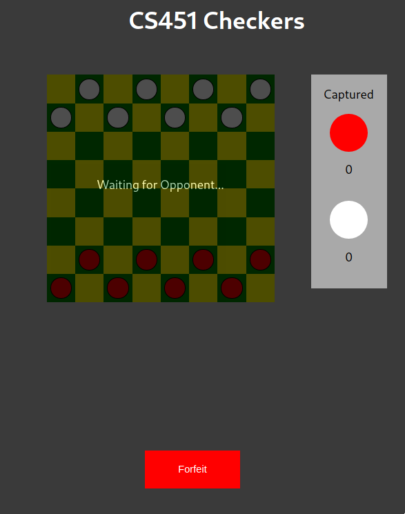

# cs451-team-1
Repository for 201845, Section 1, Group 1

 

  

  

  

  

  

 

# Install

1. [Install npm](https://www.npmjs.com/get-npm)
2. [Install yarn](https://yarnpkg.com/lang/en/docs/install)
3. Enter the `src/client` directory.
4. Run `yarn install`
5. Run `yarn build`
6. Copy the `public` directory into `src/server/`
7. Go back to the root and enter the `src/server` directory
8. Run `yarn install`
9. Run `yarn start`
10. Go to your Chrome and visit `localhost:5000`

If playing with someone else:

1. Get your local IP
2. Have them open a Chrome and visit `local-ip:5000`
3. Both enter the queue and play

To play on the same machine:

1. Open one normal Chrome window and visit `localhost:5000`
2. Open another incognito Chrome window and visit `localhost:5000`
3. Both enter the queue and play

**For bash users**

Steps 5 and 6 may be skipped and the
`build.sh` script may be ran after step 8 instead.

# Testing

Explained in the testing doc

# Static Analysis

Used `eslint` with the configuration file found at `src/.eslintrc.json`.

